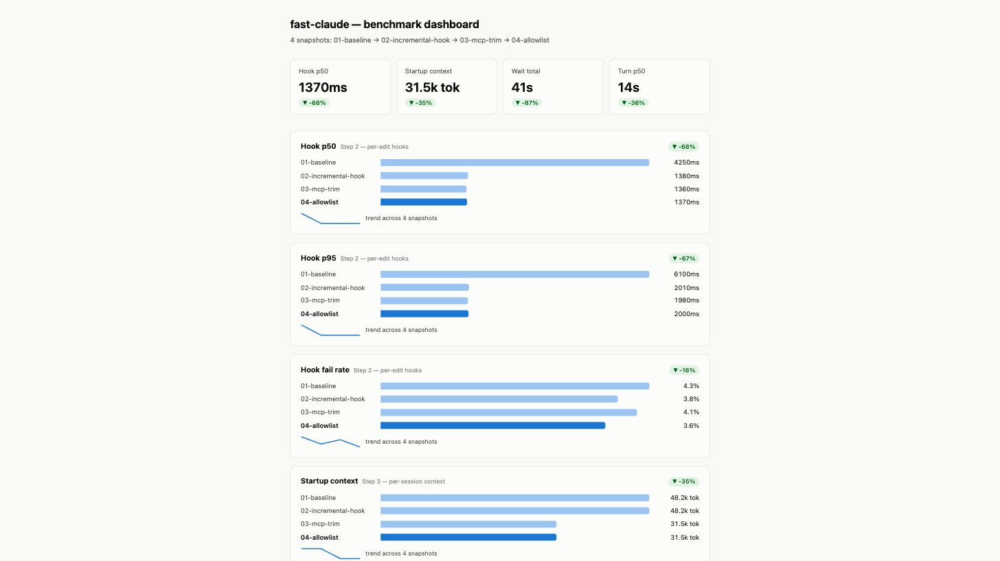

# fast-claude

A [Claude Code](https://claude.com/claude-code) skill that makes Claude Code **fast without losing quality**.

Born from a real optimization session: audit where the latency actually comes from, fix it with measured results, and — just as important — document the "speedups" that look tempting but silently destroy quality or security (they're in the skill's *Common mistakes* table).

## What it covers

1. **Measure first** — `/context`, version, timed turns. No cargo-cult tuning. [`scripts/benchmark.sh`](scripts/benchmark.sh) snapshots hook latency, startup context, permission waits, and per-turn latency, then renders a before/after HTML dashboard ([sample](docs/sample-benchmark.html)) so every change proves itself with a number.
2. **Per-edit hooks** — incremental typecheck with build state outside the repo. Measured: **4.25s → 1.38s per edit** (grows with repo size). Ready-to-use hook in [`scripts/lint-after-edit.sh`](scripts/lint-after-edit.sh).
3. **Per-session context** — trim MCP servers per project, audit plugin injections, relocate single-project skills.
4. **Permission waits** — the largest perceived latency. Safe read-only allowlist patterns; never broad wildcards.
5. **Models and effort** — where a cheaper model is free speed and where it silently degrades your results.
6. **Session hygiene** — `/clear`, `--continue`, `/compact`, and when each helps or hurts.

## Did it actually work? Benchmark it

Every optimization must prove itself with a number. `scripts/benchmark.sh` does the measuring:

```bash
export FAST_CLAUDE_DEBUG=1                    # let the edit hook log real timings
# ...use Claude Code normally for a day...
scripts/benchmark.sh snapshot baseline

# apply ONE optimization (SKILL.md Steps 2–6), use it for another day
scripts/benchmark.sh snapshot incremental-hook

scripts/benchmark.sh compare baseline incremental-hook
scripts/benchmark.sh report                   # HTML dashboard over all snapshots
scripts/benchmark.sh hook src/app.ts          # instant hook bench — no day of waiting
```

`compare` prints deltas in the terminal:

```
=== fast-claude benchmark: baseline vs incremental-hook ===
                   baseline     incremental-hook  delta
Hook p50:          4250ms       1380ms       -68%
Hook p95:          6100ms       2010ms       -67%
Startup context:   48.2k tok    48.2k tok    0%
Turn p50:          22s          18s          -18%
Human waits:       9            9            0%
```

`report` renders a dashboard of all snapshots — one per optimization, so you see which change bought what ([live sample](docs/sample-benchmark.html)):



Metrics come from the hook's debug log and from Claude Code's own session transcripts — no manual timing. Mapping: hook latency → Step 2, startup context → Step 3, human waits → Step 4, turn latency → Step 6.

## Install

Personal (all projects):

```bash
git clone https://github.com/leonardobissoli/fast-claude ~/.claude/skills/fast-claude
```

Per project:

```bash
git clone https://github.com/leonardobissoli/fast-claude .claude/skills/fast-claude
```

Then just tell Claude Code "Claude Code feels slow" — the skill triggers on that. Or read [SKILL.md](SKILL.md) yourself; it's short.

## Troubleshooting

**Hook doesn't run**
- Script must be executable: `chmod +x ~/.claude/hooks/lint-after-edit.sh`.
- The `command` in settings.json must be an **absolute** path (no `~`).
- `jq` must be installed — without it the hook warns on stderr and no-ops.
- Restart the session after editing hooks in settings.json (hooks are read at startup).

**tsc still slow**
- Run an edit with `FAST_CLAUDE_DEBUG=1` and check timings in `~/.claude/cache/fast-claude-debug.log`.
- Confirm incremental state is being written: `ls ~/.claude/cache/tsbuildinfo/`. If empty, your tsc may be too old for `--incremental` with `--noEmit` (the hook falls back to a full check — upgrade TypeScript).
- First run after a cache wipe is always a full check; the speedup shows from the second edit on.

**Permission prompts still appear**
- Rule syntax is exact: `Bash(git status:*)` — tool name, command prefix, then `:*`. `Bash(git status)` only matches the bare command with no arguments.
- Rules live in the settings file that's actually loaded — check `/permissions` in-session to see what's active.

## Tests

Covers both `scripts/lint-after-edit.sh` and `scripts/benchmark.sh`:

```bash
brew install bats-core   # or: apt install bats
bats tests/
```

## Safety notes

The skill is opinionated about what **not** to do:

- No broad allowlist wildcards (`ssh:*`, `git:*`, `curl:*`) — with auto-accept modes these become unattended production access and exfiltration vectors.
- No global cheap-model override for subagents — research quality degrades silently.
- No cutting skill descriptions to save tokens — skills stop triggering.

## License

MIT — see [LICENSE](LICENSE).
